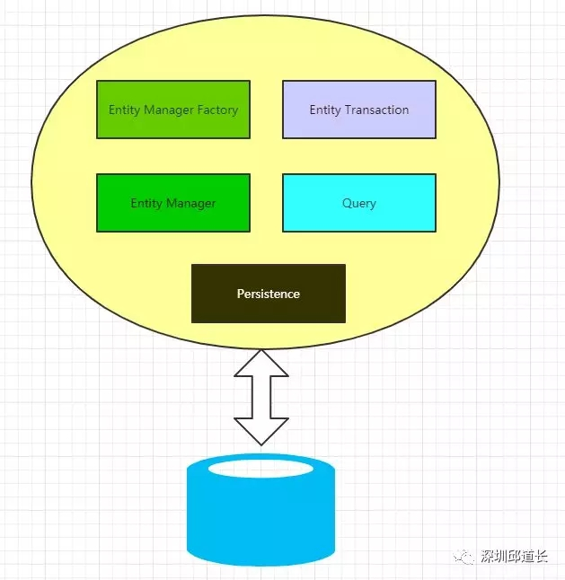
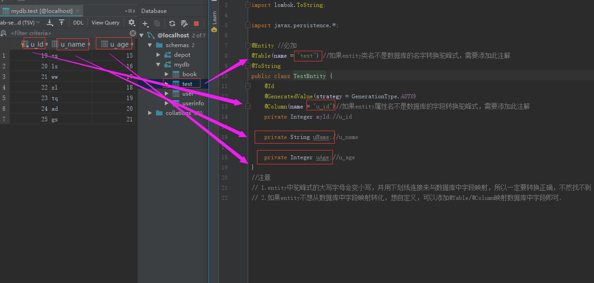
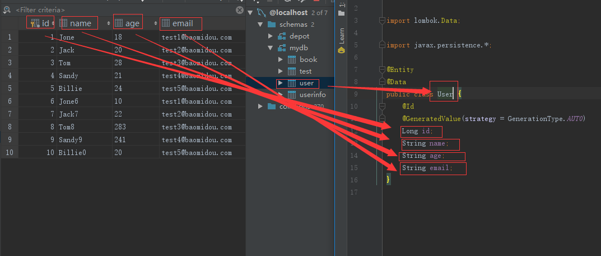
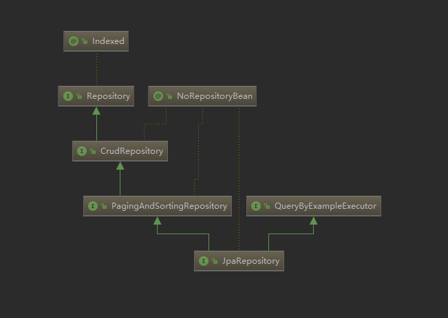

# spring data jpa

Spring Data JPA 是 Spring 基于 ORM 框架、JPA 规范的基础上封装的一套JPA应用框架，可使开发者用极简的代码即可实现对数据的访问和操作。

它提供了包括增删改查等在内的常用功能，且易于扩展！学习并使用 Spring Data JPA  可以极大提高开发效率！

spring data jpa让我们解脱了DAO层的操作，基本上所有CRUD都可以依赖于它来实现。

JPA(Java Persistence API)是Sun官方提出的Java持久化规范，用来方便大家操作数据库。

真正干活的可能是Hibernate，TopLink等等实现了JPA规范的不同厂商，默认是Hibernate。

JPA架构:
 


EntityManagerFacoty  实例管理器的工厂类，用于创建管理多个实体管理实例。

EntityManager 它是一个接口，管理持久化的操作。

Entity 需要持久化的对象，用于存储。

EntityTransaction 和EntityManager 有关系，主要管理事务

Persistence  包含静态方法，并且持有EntityManagerFacoty 的实例。

Query 这个接口由具体的实现者完成，可以执行查询功能。

# pom.xml添加依赖：

``` 
<!--MySQL-->
<dependency>
    <groupId>mysql</groupId>
    <artifactId>mysql-connector-java</artifactId>
    <scope>runtime</scope>
</dependency>
<!--lombok-->
<dependency>
    <groupId>org.projectlombok</groupId>
    <artifactId>lombok</artifactId>
</dependency>
<!--jpa-->
<dependency>
    <groupId>org.springframework.boot</groupId>
    <artifactId>spring-boot-starter-data-jpa</artifactId>
</dependency>
```

# 创建数据库
``` 
create database mydb;
```
test表：
``` 
use mydb;

DROP TABLE  IF EXISTS `test`;

CREATE TABLE `test`(
  `u_id` INT PRIMARY KEY AUTO_INCREMENT,
  `u_name` VARCHAR(16),
  `u_age` INT
)
  ENGINE = MyISAM
  AUTO_INCREMENT = 19
  DEFAULT CHARSET = utf8;

INSERT INTO `test` VALUES(NULL,'zs',15);
INSERT INTO `test` VALUES(NULL,'ls',16);
INSERT INTO `test` VALUES(NULL,'ww',17);
INSERT INTO `test` VALUES(NULL,'zl',18);
INSERT INTO `test` VALUES(NULL,'tq',19);
```
user表：
``` 
use mydb;

DROP TABLE IF EXISTS `user`;

CREATE TABLE `user` (
  `id`    int(11) NOT NULL AUTO_INCREMENT,
  `name`  varchar(255)     DEFAULT NULL,
  `age`   varchar(255)     DEFAULT NULL,
  `email` varchar(255)     DEFAULT NULL,
  PRIMARY KEY (`id`)
)
  ENGINE = MyISAM
  AUTO_INCREMENT = 19
  DEFAULT CHARSET = utf8;

INSERT INTO `user` (id, name, age, email)
VALUES (1, 'Jone', 18, 'test1@baomidou.com'),
       (2, 'Jack', 20, 'test2@baomidou.com'),
       (3, 'Tom', 28, 'test3@baomidou.com'),
       (4, 'Sandy', 21, 'test4@baomidou.com'),
       (5, 'Billie', 24, 'test5@baomidou.com');

INSERT INTO `user` (id, name, age, email)
VALUES (6, 'Jone6', 10, 'test1@baomidou.com'),
       (7, 'Jack7', 22, 'test2@baomidou.com'),
       (8, 'Tom8', 283, 'test3@baomidou.com'),
       (9, 'Sandy9', 241, 'test4@baomidou.com'),
       (10, 'Billie0', 224, 'test5@baomidou.com');

ALTER TABLE user MODIFY id BIGINT(20) AUTO_INCREMENT;

```
# application.properties配置数据库和jpa

``` 
# database
spring.datasource.url=jdbc:mysql://127.0.0.1:3306/mydb?useUnicode=true&characterEncoding=utf8&useSSL=false&serverTimezone=GMT
spring.datasource.username=root
spring.datasource.password=admin
spring.datasource.driver-class-name=com.mysql.cj.jdbc.Driver

# JPA 相关配置
spring.jpa.show-sql=true
spring.jpa.hibernate.ddl-auto=update

```

注意：

``` 
spring.jpa.show-sql=true
# 配置在日志中打印出执行的 SQL 语句信息

spring.jpa.hibernate.ddl-auto=update
# 配置指明在程序启动的时候要删除并且创建实体类对应的表。
# create 这个参数很危险，因为他会把对应的表删除掉然后重建。所以千万不要在生成环境中使用。只有在测试环境中，一开始初始化数据库结构的时候才能使用一次。
# ddl-auto:create----每次运行该程序，没有表格会新建表格，表内有数据会清空
# ddl-auto:create-drop----每次程序结束的时候会清空表
# ddl-auto:update----每次运行程序，没有表格会新建表格，表内有数据不会清空，只会更新(推荐)
# ddl-auto:validate----运行程序会校验数据与数据库的字段类型是否相同，不同会报错
```


# 创建entity映射数据库

``` 
@Entity
@Data
public class User {
    @Id
    @GeneratedValue(strategy = GenerationType.AUTO)
    Long id;
    String name;
    String age;
    String email;
}

```

``` 
import lombok.ToString;

import javax.persistence.*;

@Entity //必加
@Table(name = "test") //如果entity类名不是数据库的名字转换驼峰式，需要添加此注解
@ToString
public class TestEntity {
    @Id
    @GeneratedValue(strategy = GenerationType.AUTO)
    @Column(name = "u_id")//如果entity属性名不是数据库的字段转换驼峰式，需要添加此注解
    private Integer myId;//u_id

    private String uName;//u_name

    private Integer uAge;//u_age
}

```
注意

1.entity中驼峰式的大写字母会变小写，并用下划线连接来与数据库中字段映射，所以一定要转换正确，不然找不到

2.如果entity不想从数据库中字段映射转化，想自定义，可以添加@Table/@Column映射数据库中字段即可.

3.@Entity 是必须的注解

如图：





对象实体映射类中的注解@GeneratedValue的概念及用法：

JPA要求每一个实体Entity,必须有且只有一个主键，而@GeneratedValue注解会为一个实体生成一个唯一标识的主键。

JPA提供了四种主键生成策略,被定义在枚举类GenerationType中，分别为：

GenerationType.TABLE

使用一个特定的数据库表格来保存主键,持久化引擎通过关系数据库的一张特定的表格来生成主键。
这种策略的好处是不依赖于外部环境和数据库的具体实现，在不同数据库间可以很容易的进行移植。
但由于其不能充分利用数据库的特性，所以不会优先使用。

GenerationType.SEQUENCE

在某些数据库中不支持主键自增长，比如Oracle。其提供了一种叫做”序列(sequence)”的机制生成主键。
此时，GenerationType.SEQUENCE就可以作为主键生成策略。
该策略的不足之处正好与TABLE相反，由于只有部分数据库(Oracle,PostgreSQL,DB2)支持序列对象，所以该策略一般不应用于其他数据库。

GenerationType.IDENTITY

主键自增长策略，数据库在插入数据时，会自动给主键赋值,比如MYSQL可以在创建表时声明”auto_increment” 来指定主键自增长。
该策略在大部分数据库中都提供了支持(指定方法或关键字可能不同)，但还是有少数数据库不支持，所以可移植性略差。

GenerationType.AUTO

把主键生成策略交给持久化引擎(persistence engine)，持久化引擎会根据数据库在以上三种主键生成策略中选择其中一种。
此种主键生成策略比较常用，由于JPA默认的生成策略就是GenerationType.AUTO，
所以使用此种策略时可以显式的指定@GeneratedValue(strategy = GenerationType.AUTO)也可以直接@GeneratedValue。

# dao层（继承JpaRepository）

``` 
@Repository
public interface TestDao extends JpaRepository<TestEntity, Integer> {
}
```

``` 
@Repository
public interface UserDao extends JpaRepository<User, Long> {
}
```
注意：

1. @Repository注解是必须的

2. JpaRepository内的泛型 T ：代表entity类   ID ：代表id类型
``` 
public interface JpaRepository<T, ID> 
        extends PagingAndSortingRepository<T, ID>, QueryByExampleExecutor<T> {...}
```



Repository：最顶层的接口，是一个空的接口，目的是为了统一所有Repository的类型，且能让组件扫描的时候自动识别。

CrudRepository ：是Repository的子接口，提供CRUD的功能

PagingAndSortingRepository：是CrudRepository的子接口，添加分页和排序的功能

JpaRepository：是PagingAndSortingRepository的子接口，增加了一些实用的功能，比如：批量操作等。

# 测试

``` 
@Autowired
TestDao testDao;

@Test
public void test1() {
    List<TestEntity> all = testDao.findAll();
    for (int i = 0; i < all.size(); i++) {
        System.out.println(all.get(i).toString());
    }
}

@Autowired
UserDao userDao;

@Test
public void test2() {
    List<User> userList = userDao.findAll();
    userList.forEach(System.out::println);
}
```

# 分页

spring data jpa 已内置分页功能和排序功能：

``` 
@Test
public void test3() {
    int page =3, size = 3;
    Sort sort = new Sort(Sort.Direction.ASC, "id");
    Pageable pageable = new PageRequest(page, size, sort);
    Page<User> userPage = userDao.findAll(pageable);

    System.out.println("getNumber==" + userPage.getNumber());  //当前页页码【0，list.size-1】
    System.out.println("getNumberOfElements===" + userPage.getNumberOfElements());  //当前页元素数量
    System.out.println("getSize===" + userPage.getSize());   //每页数量size
    System.out.println("getTotalElements===" + userPage.getTotalElements());  //总数量
    System.out.println("getTotalPages====" + userPage.getTotalPages());    //总页数

    List<User> content = userPage.getContent();//数据
    for (int i = 0; i < content.size(); i++) {
        System.out.println(content.get(i).toString());
    }
}
```


